## 简介
Java 8 中主要的新语言特性是lambda表达式。可以将lambda表达式想作一种匿名方法；像方法一样，lambda表达式具有带类型的参数、主体和返回类型。但真正的亮点不是lambda表达式本身，而是它们所实现的功能。lambda表达式使得将行为表达为数据变得很容易，从而使开发具有更强表达能力、更强大的库成为可能。       
Java 8 中引入的一个这样的库是 java.util.stream 包，它有助于为各种数据来源上的可能的并行批量操作建立简明的、声明性的表达式。 Stream 视为 Java 中第一个充分利用了lambda表达式的强大功能的库，但它没有什么特别奇妙的地方（尽管它被紧密集成到核心 JDK 库中），其实就是对集合（Collection）对象功能的增强，它专注于对集合对象进行各种非常便利、高效的聚合操作（aggregate operation），或者大批量数据操作 (bulk data operation)。Stream API 借助于同样新出现的 lambda 表达式，极大的提高编程效率和程序可读性。同时它提供串行和并行两种模式进行汇聚操作，并发模式能够充分利用多核处理器的优势，通常编写并行代码很难而且容易出错, 但使用 Stream API 无需编写一行多线程的代码，就可以很方便地写出高性能的并发程序。所以说，Java 8 中首次出现的 java.util.stream 是一个函数式语言+多核时代综合影响的产物。

## 概念
### 什么是流
Stream 不是集合元素，它不是数据结构并不保存数据，它是有关算法和计算的，它更像一个高级版本的 Iterator。原始版本的 Iterator，用户只能显式地一个一个遍历元素并对其执行某些操作；高级版本的 Stream，用户只要给出需要对其包含的元素执行什么操作，比如 “过滤掉长度大于 10 的字符串”、“获取每个字符串的首字母”等，Stream 会隐式地在内部进行遍历，做出相应的数据转换。
Stream 就如同一个迭代器（Iterator），单向，不可往复，数据只能遍历一次，遍历过一次后即用尽了，就好比流水从面前流过，一去不复返。
而和迭代器又不同的是，Stream 可以并行化操作，迭代器只能命令式地、串行化操作。顾名思义，当使用串行方式去遍历时，每个 item 读完后再读下一个 item。而使用并行去遍历时，数据会被分成多个段，其中每一个都在不同的线程中处理，然后将结果一起输出。
### 流的构成
当我们使用一个流的时候，通常包括三个基本步骤：
获取一个数据源（source）→ 数据转换→执行操作获取想要的结果，每次转换原有 Stream 对象不改变，返回一个新的 Stream 对象（可以有多次转换），这就允许对其操作可以像链条一样排列，变成一个管道，如下图所示：                 
                                                                    
                   
生成流的常用方式：
方法	                   描述
Collection.stream()	     使用一个集合的元素创建一个流。
Stream.of(T...)	         使用传递给工厂方法的参数创建一个流。
Stream.of(T[])	         使用一个数组的元素创建一个流。
Stream.empty()	         创建一个空流。
BufferedReader.lines()	 创建一个有来自 BufferedReader 的行组成的流。
流的操作类型分为两种：
* Intermediate：一个流可以后面跟随零个或多个 intermediate 操作。其目的主要是打开流，做出某种程度的数据映射/过滤，然后返回一个新的流，交给下一个操作使用。这类操作都是惰性化的（lazy），就是说，仅仅调用到这类方法，并没有真正开始流的遍历。
* Terminal：一个流只能有一个 terminal 操作，当这个操作执行后，流就被使用“光”了，无法再被操作。所以这必定是流的最后一个操作。Terminal 操作的执行，才会真正开始流的遍历，并且会生成一个结果，或者一个 side effect。                      
在对于一个 Stream 进行多次转换操作 (Intermediate 操作)，每次都对 Stream 的每个元素进行转换，而且是执行多次，这样时间复杂度就是 N（转换次数）个 for 循环里把所有操作都做掉的总和吗？其实不是这样的，转换操作都是 lazy 的，多个转换操作只会在 Terminal 操作的时候融合起来，一次循环完成。我们可以这样简单的理解，Stream 里有个操作函数的集合，每次转换操作就是把转换函数放入这个集合中，在 Terminal 操作的时候循环 Stream 对应的集合，然后对每个元素执行所有的函数。

## 流的使用详解
对 Stream 的使用就是实现一个 filter-map-reduce 过程，产生一个最终结果，或者导致一个副作用（side effect）。这个过程可以想象成如下图一样：    
                    
        
### 流的构造与转换
下面提供最常见的几种构造 Stream 的样例。
构造流的几种常见方法
```java
// 1. Individual values
Stream stream = Stream.of("a", "b", "c");
// 2. Arrays
String [] strArray = new String[] {"a", "b", "c"};
stream = Stream.of(strArray);
stream = Arrays.stream(strArray);
// 3. Collections
List<String> list = Arrays.asList(strArray);
stream = list.stream();
```
需要注意的是，对于基本数值型，目前有三种对应的包装类型 Stream：
IntStream、LongStream、DoubleStream。当然我们也可以用 Stream<Integer>、Stream<Long>、Stream<Double>，但是 boxing 和 unboxing 会很耗时，所以特别为这三种基本数值型提供了对应的 Stream。
流转换为其它数据结构
```java
// 1. Array
String[] strArray1 = stream.toArray(String[]::new);
// 2. Collection
List<String> list1 = stream.collect(Collectors.toList());
List<String> list2 = stream.collect(Collectors.toCollection(ArrayList::new));
Set set1 = stream.collect(Collectors.toSet());
Stack stack1 = stream.collect(Collectors.toCollection(Stack::new));
// 3. String
String str = stream.collect(Collectors.joining()).toString();
```
###流的操作
当把一个数据结构包装成 Stream 后，就要开始对里面的元素进行各类操作了。常见的操作可以归类如下。
* Intermediate：
map (mapToInt, flatMap 等)、 filter、 distinct、 sorted、 peek、 limit、 skip、 parallel、 sequential、 unordered
* Terminal：
forEach、 forEachOrdered、 toArray、 reduce、 collect、 min、 max、 count、 anyMatch、 allMatch、 noneMatch、 findFirst、 findAny、 iterator
      
#### map/flatMap
它的作用就是把 input Stream 的每一个元素，映射成 output Stream 的另外一个元素。
转换成大写
```java
List<String> output = wordList.stream().
map(String::toUpperCase).
collect(Collectors.toList());
```
生成平方数
```java
List<Integer> nums = Arrays.asList(1, 2, 3, 4);
List<Integer> squareNums = nums.stream().
map(n -> n * n).
collect(Collectors.toList());
```
map 生成的是个 1:1 映射，每个输入元素，都按照规则转换成为另外一个元素。还有一些场景，是一对多映射关系的，这时需要 flatMap。
一对多
```java
Stream<List<Integer>> inputStream = Stream.of(
 Arrays.asList(1),
 Arrays.asList(2, 3),
 Arrays.asList(4, 5, 6)
 );
Stream<Integer> outputStream = inputStream.
flatMap((childList) -> childList.stream());
```
flatMap 把 input Stream 中的层级结构扁平化，就是将最底层元素抽出来放到一起，最终 output 的新 Stream 里面已经没有 List 了，都是直接的数字。
#### filter
filter 对原始 Stream 进行某项测试，通过测试的元素被留下来生成一个新 Stream。
留下偶数
```java
Integer[] sixNums = {1, 2, 3, 4, 5, 6};
Integer[] evens =
Stream.of(sixNums).filter(n -> n%2 == 0).toArray(Integer[]::new);
```
经过条件“被 2 整除”的 filter，剩下的数字为 {2, 4, 6}。
